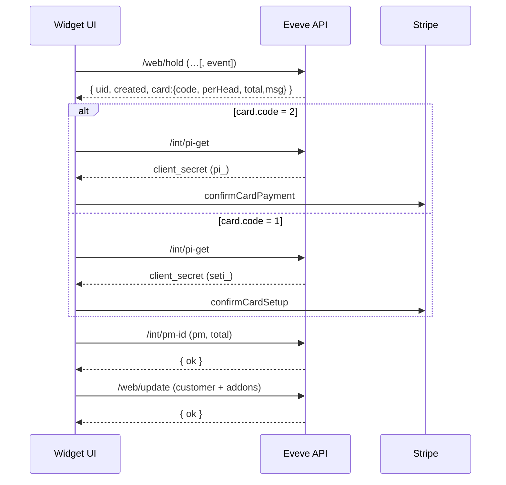

# Eveve + Stripe Payments: Current Implementation and Events Support

## Executive Summary
- The booking widget already contains a complete Stripe integration supporting both PaymentIntents (immediate charge) and SetupIntents (card-on-file) driven by Eveve’s APIs.  
- “Events Stripe payment” re-uses the same flow.  Differences:  
  • The initial **hold** call adds `event=<id>` when an event shift/time is selected.  
  • The hold response’s **card** requirement (`code`) and **perHead / total** amounts decide whether we charge now (`code=2`) or just store a card (`code=1`).  
  • For per-party events Eveve still sends a _per-guest_ amount so that `perHead × covers = total` (e.g. $123 per party → `perHead = 6150`, `total = 12300`).  
- The widget maps Eveve’s `client_secret` to SetupIntent vs PaymentIntent by prefix (`seti_` vs `pi_`).  
- Remaining gaps:  
  1. Normalise the hold response so both legacy numeric `card` and the newer object shape `card:{code,perHead,total,msg}` are supported.  
  2. Ensure `event` is forwarded on the **/web/hold** request whenever an event id is present in availability data.

## Terminology and Rules (from Eveve)
| card.code | Meaning | Stripe intent |
|-----------|---------|---------------|
| 0 | No card required | – |
| 1 | Card registration only – possible later charge | **SetupIntent** |
| 2 | Deposit taken at time of booking | **PaymentIntent** |

*perHead* = cents per guest • *total* = overall cents to pass to Stripe.

## Architecture Overview
Component / file | Responsibility
---|---
`src/api/stripe.js` | Single cached Stripe instance, confirmSetupIntent / confirmPaymentIntent, intent-type detection
`src/api/eveve.js` | Thin axios client for **hold / pi-get / deposit-get / pm-id / update / restore**
`src/hooks/booking/useStripePayment.js` | Orchestration: fetch keys → deposit info → confirm intent → attach pm-id
`src/utils/chargeDetection.js` | Determines if payment needed; calculates effective amounts incl. shift/addon overrides
`src/components/booking/BookingDetailsModal.jsx` | UI sequence: payment-first then update
`src/components/ReservationForm.jsx` | Availability search → build hold request (needs `event`) → open modal
`stripe-booking-form-test/.../UnifiedBookingForm.jsx` | Stand-alone harness with detailed logging

## End-to-End Flow

1. **User picks** date / time / covers / addons / area *(ReservationForm)*  
2. **HOLD** `GET /web/hold?est=…&covers=…&event=…`  
3. Widget inspects `card.code` & amounts → decides Setup vs Payment path.  
4. **PI-GET** returns `client_secret` + `public_key`.  
5. **Deposit-get** (unless shift.charge = 2 override) returns final amount / code.  
6. **Stripe confirm** (SetupIntent or PaymentIntent).  
7. **PM-ID** attaches payment method & echoes code/amount.  
8. **UPDATE** sends customer details & addons.  

### Sequence Diagram


## Data Structures
### HOLD (event example)
```json
{
  "ok": true,
  "uid": 42099,
  "created": 1752799999,
  "card": {      // new shape
    "code": 1,
    "perHead": 3000,
    "total": 6000,
    "msg": "A charge of 30.00 per person will be applied in the event of a no-show<br/>"
  },
  "covers": 2,
  "event": 1005
}
```
Legacy shape: `card:2, perHead:3000`.

### PI-GET / DEPOSIT-GET / PM-ID  
See `docs/EVEVE_STRIPE_REQUESTS.md` for full samples.

## Charge Detection Highlights
Function | Purpose
---|---
`isPaymentRequired()` | Combines hold.card, shift.charge, addon.charge to boolean
`getEffectiveHoldData()` | When shift.charge = 2 it forces `card=2` and sets `perHead` to computed addon total
`useStripePayment.completePaymentFlow()` | Throws if Eveve intent type mismatches deposit/no-show rule

## Events Overlay
- Availability response includes `event` id on certain shifts/times.  
- **ReservationForm** should store that id and pass it to `holdBooking`.  
- All downstream endpoints are unchanged.

## Implementation Gaps & Recommendations
### 1 – Normalise HOLD payload
```js
// utils/holdNormalize.js
export function normalizeHold(hold) {
  const obj = typeof hold.card === 'object' ? hold.card : {
    code: hold.card ?? 0,
    perHead: hold.perHead ?? 0,
    total: hold.total ?? 0,
    msg: hold.msg || ''
  };
  return { ...hold,
    card: obj.code,
    perHead: obj.perHead,
    total: obj.total,
    cardMessage: obj.msg
  };
}
```
Integrate right after `holdBooking()` fetch.

### 2 – Forward `event` on HOLD
- Capture `event` from availability (`shift.event` or `time.event`).  
- Include when building the hold URL in `useHoldBooking`.  

### 3 – Sanity checking (already present)
Keep warning in `useStripePayment` if SetupIntent vs PaymentIntent mismatches Eveve’s `code`.

### 4 – UX copy
Display `hold.cardMessage` to users for clarity.

## Developer Guide
Step | Code pointer
---|---
Capture event id | `ReservationForm.handleTimeSelection`
Add event param | `useHoldBooking.holdBooking`
Normalize hold | new `normalizeHold()` before passing to modal
Payment orchestration | `useStripePayment.completePaymentFlow`
Attach PM | `useStripePayment.attachPaymentMethod`
Update booking | `useUpdateHold` or direct `/web/update`

## Test Matrix

Scenario | Expectation
---|---
card.code = 0 | No payment UI; straight to update
card.code = 1 (no-show) | SetupIntent (`seti_`); pm-id total matches hold.total
card.code = 2 (deposit) | PaymentIntent (`pi_`); immediate charge; pm-id total matches
shift.charge = 2 | Internal override; deposit path even if hold.card=0
Event booking | Hold includes `event`; otherwise identical
Declined card | Stripe 4000 0000 0000 0002 → do **not** call update

## Security & Logging
- Only publishable key in browser; secret key never exposed.  
- Shared Stripe instance cached on `globalThis` to avoid “use the same instance” errors.  
- Debug/timing logs gated behind `debug` flag; safe for UAT.

## Sources
1. `src/hooks/booking/useStripePayment.js`  
2. `src/api/eveve.js`  
3. `src/api/stripe.js`  
4. `src/utils/chargeDetection.js`  
5. `src/components/booking/BookingDetailsModal.jsx`  
6. `src/components/ReservationForm.jsx`  
7. `docs/EVEVE_STRIPE_REQUESTS.md`  
8. `stripe-booking-form-test/src/components/UnifiedBookingForm.jsx`
